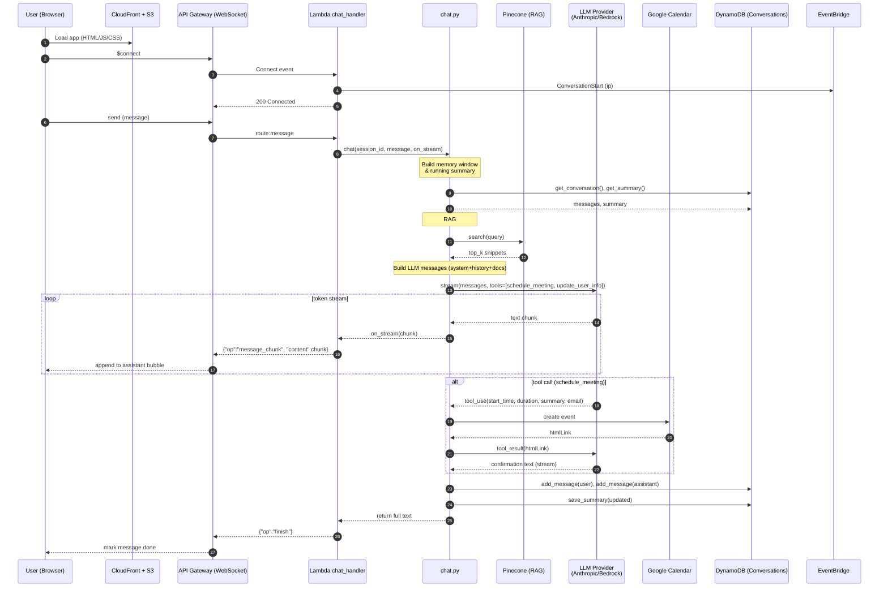
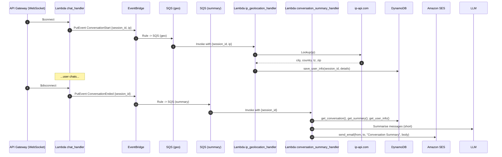

<picture>
  <source media="(prefers-color-scheme: light)">
  
</picture>

**Minime**: AI Personal Assistant

<a href="https://gfonseca.io"> gfonseca.io</a>

---
Minime is an AI-powered chat assistant that lives on my personal website.
It acts as an AI version of me — able to talk about my background, projects, and even schedule meetings through natural conversation.

It combines:
- Large Language Models (LLMs) for dialogue
- Retrieval-Augmented Generation (RAG) from my Notion knowledge base
- A serverless, event-driven AWS architecture
- Infrastructure as Code (Terraform)
- CI/CD, monitoring, and security best practices

## Features
- **Conversational AI**: Streamed responses via WebSocket for a natural chat feel
- **Personalized knowledge**: RAG retrieval from Notion content via Pinecone
- **Meeting scheduling**: Google Calendar integration for booking calls
- **Geolocation awareness**: Enriches user profile from IP location
- **Email summaries**: Sends conversation summaries via SES
- **Rate limiting**: DynamoDB-backed token bucket to protect resources (💰)
- **Event-driven design**: AWS EventBridge + SQS orchestration

## System Architecture

<picture>
  <source media="(prefers-color-scheme: light)">
  
</picture>

### Flow:
1. Frontend:
   - Static site on S3 served via CloudFront
   - Connects to backend via API Gateway (WebSocket) for low-latency streaming
2. Chat Handling:
   - `chat_handler` Lambda manages incoming messages, streams model output back
   - Rate limiting and error handling built-in 
3. Retrieval:
   - Queries Pinecone with embeddings from Notion documents
4. LLM Invocation:
   - Uses Amazon Bedrock & Anthropic Claude
5. Backend Events:
   - EventBridge + SQS for async tasks like IP geolocation & conversation summaries
   - Summaries emailed via SES
   - Meetings scheduled in Google Calendar

### **Realtime Streaming Flow**

### **Async Tasks: IP Geo & Summaries**

